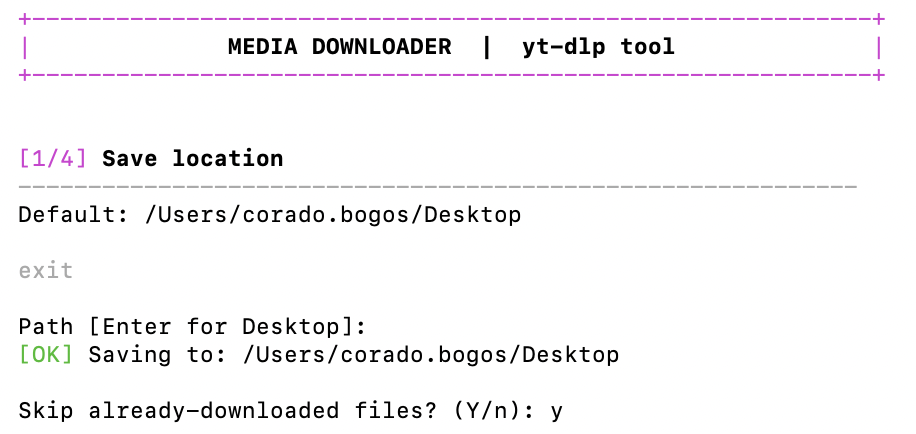
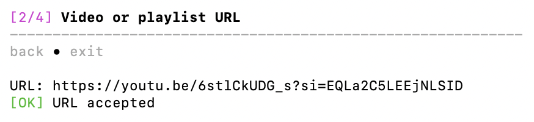
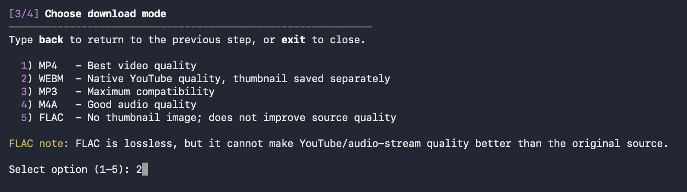
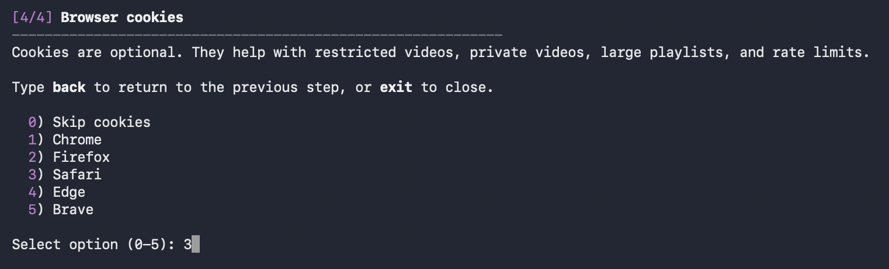
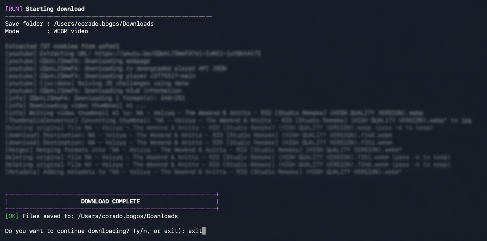

# yt-dlp-media-tools

A beginner-friendly macOS terminal tool for downloading videos, audio, and playlists from YouTube and other platforms.

[](https://www.gnu.org/software/bash/)
[](#requirements)
[](CHANGELOG.md)
[](LICENSE.md)

---

## Table of Contents

- [Overview](#overview)
- [Features](#features)
- [Requirements](#requirements)
- [Quick Install](#quick-install)
- [Manual Installation](#manual-installation)
- [Updating](#updating)
- [Uninstall](#uninstall)
- [Usage](#usage)
- [Download Formats](#download-formats)
- [Output Structure](#output-structure)
- [Archive Tracking](#archive-tracking)
- [Optional Logs](#optional-logs)
- [Screenshots](#screenshots)
- [Support](#support)
- [License](#license)

---

## Overview

**yt-dlp-media-tools** is a simple interactive shell script that wraps the powerful [`yt-dlp`](https://github.com/yt-dlp/yt-dlp) tool into an easy step-by-step macOS experience — no technical knowledge required.

It lets you download:

- Videos (`MP4`, `WEBM`)
- Audio (`MP3`, `M4A`, `FLAC`)
- Full playlists

This project supports **macOS only**.

---

## Features

- Interactive step-by-step prompts — no commands to memorize
- 5 download formats: MP4, WEBM, MP3, M4A, FLAC
- Works with single videos and full playlists
- Files named automatically with artist/uploader and title
- Playlist numbering added when a playlist index exists
- Skips already-downloaded files automatically via `archive.txt`
- Optional browser cookies from Chrome, Firefox, Safari, Edge, or Brave
- Thumbnails embedded or saved separately depending on the format
- Automatic retry on failed downloads
- One-line install — sets everything up from scratch, including Homebrew
- Global `ytmt` command — run the tool from any folder after install

---

## Requirements

- macOS
- Terminal
- Internet connection

The installer handles everything else — Apple Command Line Tools, Homebrew, `git`, `yt-dlp`, and `ffmpeg` — with a `[y/N]` confirmation before installing anything.

---

## Quick Install

Open Terminal and run:

```bash
bash -c "$(curl -fsSL https://raw.githubusercontent.com/corado-bogos/yt-dlp-media-tools/main/install.sh)"
```

This one command will:

1. Confirm you are on macOS
2. Check for Apple Command Line Tools — offer to install if missing
3. Check for Homebrew — offer to install if missing
4. Ask before installing `git`, `yt-dlp`, and `ffmpeg` if missing
5. Download the project into `~/.local/share/yt-dlp-media-tools`
6. Verify that `yt-dlp` and `ffmpeg` actually run
7. Create a global `ytmt` command, available from any folder

Each step asks a `[y/N]` question. Type `y` and press Enter to continue.

Once finished, start the tool from any terminal window:

```bash
ytmt
```

---

### Unattended Install

To auto-confirm every installer prompt:

```bash
YTMT_ASSUME_YES=1 bash -c "$(curl -fsSL https://raw.githubusercontent.com/corado-bogos/yt-dlp-media-tools/main/install.sh)"
```

> Homebrew and macOS may still ask for a password or require Apple Command Line Tools interaction depending on your system.

---

### Custom Install Path

To install into a different directory:

```bash
YTMT_INSTALL_DIR="$HOME/my-tools/yt-dlp-media-tools" bash -c "$(curl -fsSL https://raw.githubusercontent.com/corado-bogos/yt-dlp-media-tools/main/install.sh)"
```

---

### Security Note

Piping `curl | bash` runs a remote script directly on your machine. If you prefer to review the code first, read [install.sh](install.sh), then use the [manual installation](#manual-installation) below.

---

## Manual Installation

Clone the repository and run the installer locally:

```bash
git clone https://github.com/corado-bogos/yt-dlp-media-tools
cd yt-dlp-media-tools
chmod +x install.sh
./install.sh
```

The installer will check for and install missing macOS dependencies through Homebrew, create the global `ytmt` command, and update your shell profile.

---

## Updating

Re-run the same one-line command at any time:

```bash
bash -c "$(curl -fsSL https://raw.githubusercontent.com/corado-bogos/yt-dlp-media-tools/main/install.sh)"
```

The installer detects an existing installation at `~/.local/share/yt-dlp-media-tools`, pulls the latest changes with `git pull --ff-only`, and re-runs the local setup.

If you have local edits in that folder, commit or stash them first. The installer will not overwrite local changes with destructive Git commands.

---

## Uninstall

Remove the project and the global command:

```bash
rm -rf ~/.local/share/yt-dlp-media-tools
rm -f ~/.local/bin/ytmt
```

Then remove the installer block from your shell profile (`~/.zprofile`, `~/.zshrc`, `~/.bash_profile`, or `~/.bashrc`):

```text
# >>> yt-dlp-media-tools installer >>>
...
# <<< yt-dlp-media-tools installer <<<
```

---

## Usage

After installation, run from any folder:

```bash
ytmt
```

Or from inside the project folder:

```bash
./yt-dlp-media-tools.sh
```

The tool walks you through 4 steps.

---

### Step 1 — Save Location

Press Enter to use your Desktop, or paste a path to any existing folder.

```text
~/Desktop
~/Downloads
/Users/yourname/Music
```

> **macOS tip:** In Finder, hold `Option`, right-click a folder, and choose **Copy as Pathname** to get the exact path.

You can type `back` at any later step to return to the previous one, or `exit` at any prompt to close the tool.

---

### Step 2 — URL

Paste a single video URL or a full playlist URL. The URL must start with `http://` or `https://`. If the URL is invalid, the tool asks again instead of closing.

---

### Step 3 — Download Mode

```text
1) MP4  - Best video quality
2) WEBM - Native YouTube quality, thumbnail saved separately
3) MP3  - Maximum compatibility
4) M4A  - Good audio quality
5) FLAC - No thumbnail; does not improve source quality
```

All modes require `ffmpeg`. If it is missing, run `./install.sh`.

---

### Step 4 — Browser Cookies

```text
0) Skip cookies
1) Chrome
2) Firefox
3) Safari
4) Edge
5) Brave
```

Cookies are optional. They help with age-restricted videos, login-required content, large playlists, and YouTube rate limits. If cookie loading fails, the tool asks whether to continue without them.

> **Safari note:** Safari may require Full Disk Access for Terminal in System Settings → Privacy & Security. If Safari fails, use Chrome, Brave, Edge, or Firefox.

---

## Download Formats

### Video

| Mode | Format | Thumbnail |
|---|---|---|
| 1 | MP4 | Embedded when supported |
| 2 | WEBM | Saved separately as `.jpg` |

Both modes download the best available streams, merge them, and embed metadata.

### Audio

| Mode | Format | Best for | Thumbnail |
|---|---|---|---|
| 3 | MP3 | Universal — cars, phones, speakers | Embedded when supported |
| 4 | M4A | Good quality, smaller files | Embedded when supported |
| 5 | FLAC | Lossless conversion from source | Not embedded |

> **FLAC note:** FLAC is lossless, but it cannot improve quality beyond the original compressed source audio.

---

## Output Structure

Playlist downloads include an index number:

```text
Music/
├── 001 - Artist - Song Title.mp3
├── 002 - Artist - Song Title.mp3
└── 003 - Artist - Song Title.mp3
```

Single video downloads omit the index:

```text
Music/
└── Artist - Song Title.mp4
```

If artist or uploader metadata is missing, the tool uses a safe fallback instead of generating an empty filename.

---

## Archive Tracking

After the first run, the tool creates `archive.txt` in your save folder. This file records every downloaded item. Running the tool again on the same playlist automatically skips files you already have.

To re-download a file, remove its line from `archive.txt` or delete the file to reset the entire history.

---

## Optional Logs

By default, the tool keeps the terminal output clean. To save the full `yt-dlp` output from the latest run:

```bash
YTMT_KEEP_LOG=1 ytmt
```

The log is saved as `ytmt-last-run.log` in your selected download folder.

---

## Screenshots











---

## Support

For bugs or questions, open an issue:
https://github.com/corado-bogos/yt-dlp-media-tools/issues

For common fixes, see [TROUBLESHOOTING.md](TROUBLESHOOTING.md).

Private contact: `corado.dev@icloud.com`

---

## License

This project is for **personal and educational use only** under a custom license.
It is **not** an OSI-approved open-source license.

See [LICENSE.md](LICENSE.md) for full terms.
