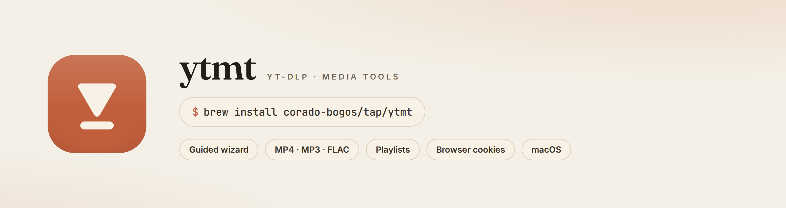

<p align="center">
  
</p>

# ytmt — Brand Kit

The visual identity for **ytmt** (`yt-dlp-media-tools`): warm paper, a terracotta clay
accent, and an editorial serif. Everything here is generated from **HTML + one shared
stylesheet**, so the logo, colors, and type stay identical across every asset.

Open [`index.html`](index.html) in a browser for the full, live brand guide.

## The system

| Token | Value | Role |
|-------|-------|------|
| Paper | `#F4F0E7` | Primary canvas (warm cream) |
| Clay  | `#C15F3C` | Primary accent (terracotta) |
| Clay deep | `#A24B2C` | Pressed / deep accent |
| Ink   | `#221F18` | Headlines, wordmark |
| Muted | `#6E6656` | Secondary text |
| Serif | **Fraunces** | Headlines + `ytmt` wordmark |
| Sans  | **Inter** | UI, labels, overlines |
| Mono  | **JetBrains Mono** | Commands |

The mark is a downward **play-glyph on a rounded clay tile** — *press play, save it*.
Fonts are embedded (base64) inside [`brand.css`](brand.css), so no network or install is
needed to view any asset.

## Files

| File | Size | Use |
|------|------|-----|
| `mark.svg` / `mark-mono.svg` | vector | Scalable logomark (favicons, inline badges). `mark-mono.svg` inherits `currentColor`. |
| `logomark.png` | 512² | Transparent app / avatar mark |
| `logo-horizontal.png` · `-dark` | 1000×300 | Primary lockup, light & dark |
| `logo-stacked.png` | 600×640 | Vertical lockup |
| `avatar.png` · `avatar-clay.png` | 512² | GitHub / social avatar |
| `favicon.png` · `-64` · `-32` | 256/64/32 | Browser tab icon |
| `social-preview.png` | 1280×640 | GitHub → *Settings → Social preview* |
| `og-card.png` | 1200×630 | Open Graph / link unfurls |
| `x-banner.png` | 1500×500 | X / Twitter profile header |
| `readme-hero.png` | 1280×340 | Banner atop the main README |

Each `*.png` has a matching `*.html` source in this folder.

## Regenerating

The PNGs are rendered from the HTML sources with a headless browser:

```bash
./render.sh            # autodetects Chrome/Chromium
CHROME="/path/to/chrome" ./render.sh
```

Edit an `*.html` source (or `brand.css`) and re-run to keep every asset in sync.

## Applying the brand

- **Repo social card:** upload `social-preview.png` under *Settings → General → Social preview*.
- **Org / profile avatar:** use `avatar-clay.png` (crops cleanly to a circle).
- **X / Twitter:** header = `x-banner.png`, avatar = `avatar-clay.png`.
- **README:** `readme-hero.png` is already wired into the project README.
- **Favicon / docs site:** `mark.svg` or `favicon.png`.

---

Not affiliated with Anthropic. This identity is an original warm-paper design.
